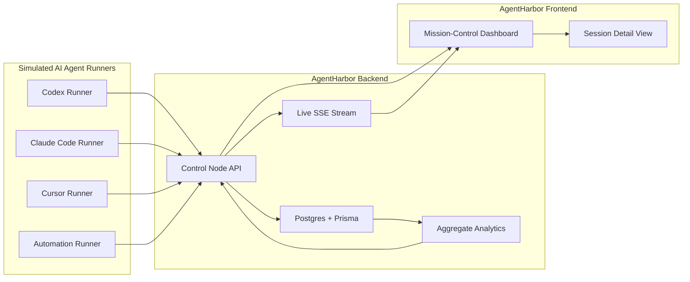
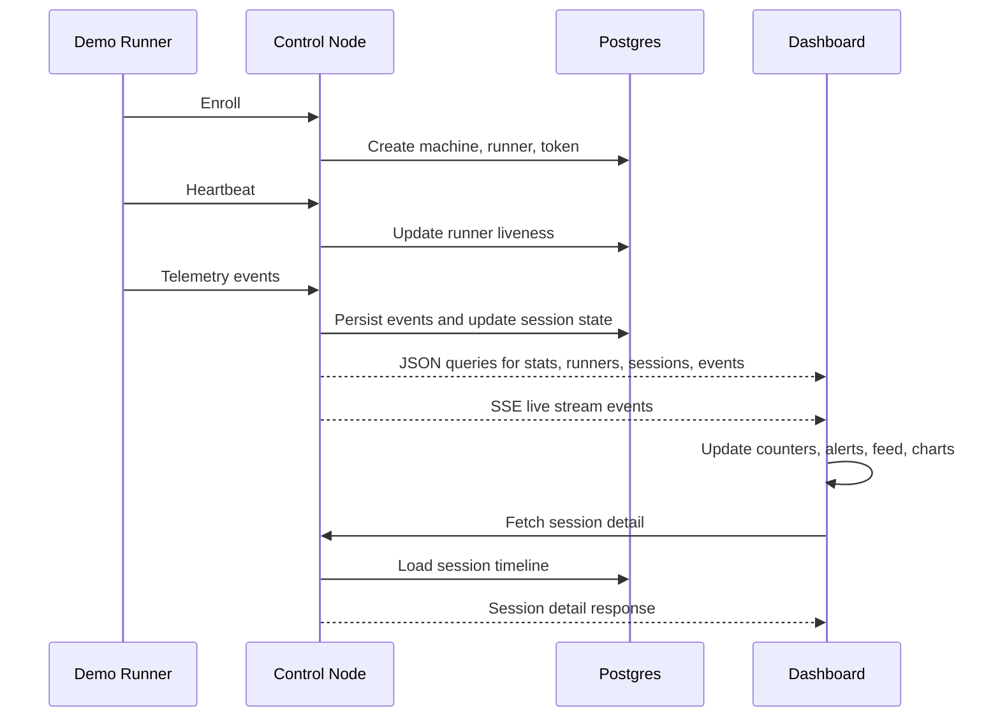

# Senior Design Deliverable

## Working Title

**AgentHarbor: A Live Mission-Control Platform for Distributed AI Coding Agents**

## Purpose

This document defines the combined deliverable produced by the frontend and backend teams.

It answers one question clearly:

**What are we actually building and demonstrating on demo day?**

The answer is not "an AI agent orchestrator."
The answer is not "a generic dashboard."

The deliverable is a polished, live, end-to-end observability platform that lets an operator:

- enroll and monitor multiple AI-agent runners
- observe live heartbeats and structured telemetry
- track session progress across multiple machines and agent types
- detect failures in real time
- drill into a session timeline to understand what happened
- view fleet-level analytics that respond to live activity

In short:

**We are building the control tower for AI coding agents.**

## One-Sentence Demo Pitch

AgentHarbor is a live control-plane dashboard that shows what distributed AI coding agents are doing across a fleet of machines, in real time, with session history, telemetry, failure visibility, and operational analytics.

## The Final Product

By demo day, the combined frontend and backend system should function as one coherent product with four major capabilities:

1. **Fleet visibility**
   - The system shows which runners are enrolled, online, active, offline, or failing.
2. **Live session monitoring**
   - The system shows active and recent agent sessions with statuses, summaries, and progress.
3. **Structured event intelligence**
   - The system ingests telemetry events and turns them into understandable session timelines, alerts, and metrics.
4. **Operator-grade presentation**
   - The interface is polished enough that an audience can understand the system in seconds.

## What The Audience Will See

The audience should experience the product in this order:

1. A mission-control dashboard opens with live fleet status already visible.
2. Multiple runners begin reporting as if Codex, Claude Code, Cursor, and an automation worker are active.
3. Cards, counters, charts, and event feeds begin updating live.
4. One session succeeds and another session fails.
5. An alert appears for the failure.
6. The presenter clicks into the failed session.
7. A session detail page shows the timeline of structured events and explains why the session failed.
8. The presenter returns to the dashboard and shows filtering, analytics, and runner grouping.
9. Optionally, the presenter revokes a token or simulates a runner outage and shows the system reacting.

If that experience works cleanly, the project will present as a real platform rather than a collection of disconnected features.

## What We Are Delivering

### 1. A Live Control Node

The backend will provide:

- runner enrollment
- token-based runner authentication
- heartbeat ingestion
- telemetry ingestion
- session state aggregation
- filterable fleet, session, and event APIs
- analytics endpoints
- a live event stream for the dashboard

### 2. A Demo-Ready Runner System

The backend will also provide:

- multiple simulated runners
- multiple agent types
- multiple demo scenarios
- automatic heartbeat behavior
- deterministic success and failure scenarios for presentation

### 3. A Mission-Control Dashboard

The frontend will provide:

- a dashboard homepage with live fleet visibility
- filter controls tied to backend query parameters
- a live telemetry/event feed
- analytics charts and status summaries
- an alert rail for failures and offline runners
- a drilldown page for session timelines

### 4. A Presentation Flow

Together, the frontend and backend will support a demo that can be repeated reliably:

- from a clean database
- with seeded or simulated data
- with live activity on screen
- with at least one planned failure scenario

## System Overview

## Core User Story

The core user of this system is an operator supervising AI coding agents across several machines.

That operator needs to answer these questions:

- Which agents are online right now?
- Which sessions are currently active?
- Which sessions recently failed?
- Which machines are generating the most activity?
- What happened inside a specific session?
- Is the system healthy overall?

The final deliverable succeeds if the system answers those questions quickly and visually.

## Demo Day Scenario

The demo should be built around one strong, rehearsed scenario.

### Act 1: Establish The System

The presenter opens the dashboard and explains:

- this is AgentHarbor
- it monitors distributed AI coding agents
- each runner represents an AI agent running on a machine
- the dashboard is the operator's control tower

The UI should already show:

- total runners
- online runners
- active sessions
- recent event volume

### Act 2: Start Live Activity

The presenter starts the demo scenario or has it already running.
The audience sees:

- new heartbeats
- session cards
- event feed activity
- analytics movement
- live updates without refreshing the page

This moment is critical.
It proves the platform is not a static mockup.

### Act 3: Show A Failure

One of the demo scenarios intentionally fails.
The audience sees:

- a failure alert
- a failed session badge
- event feed entries related to the failure
- a chart or metric reacting to the failure burst

This is the moment where the product becomes operationally meaningful.

### Act 4: Drill Into The Session

The presenter clicks the failed session.
The session detail page shows:

- session summary
- runner and agent type
- started time and duration
- files touched and token usage
- ordered timeline of events
- failure category and explanatory summary

The presenter explains what happened without needing raw logs.

### Act 5: Show Operator Control

The presenter returns to the main dashboard and shows:

- filtering by agent type
- filtering by runner or label
- grouping or focusing the view
- optionally revoking a token or simulating a runner going offline

This proves the system is useful for supervision, not just passive display.

## End-To-End Product Flow

## Product Surfaces Included In The Deliverable

### Homepage Dashboard

This page should include:

- top-level platform summary
- metric strip
- fleet/runners panel
- sessions panel
- live telemetry feed
- alert rail
- analytics section
- filters

This is the page that sells the project immediately.

### Session Detail Page

This page should include:

- session title or summary
- status
- runner identity
- agent type
- event count
- duration
- files touched
- token usage
- ordered event timeline
- failure explanation when applicable

This is the page that proves the backend data model and the frontend storytelling both work.

## Backend + Frontend Integration Contract

The final deliverable depends on the frontend and backend behaving like one system.

### Backend must provide

- stable JSON contracts
- filters the frontend can drive
- realistic demo traffic
- low-latency live streaming
- meaningful failure categories
- reliable analytics data

### Frontend must provide

- UI surfaces that consume real backend filters
- live update handling
- clear visual distinction between healthy and failing states
- readable timelines and analytics
- graceful loading/error/disconnect states

### Combined outcome

The audience should never feel that the frontend is faking what the backend cannot do.
The frontend should be a direct expression of the backend's real capabilities.

## Success Criteria

The final deliverable is successful if all of the following are true on demo day:

### Product criteria

- The dashboard opens cleanly and shows real data.
- Multiple runners can be shown concurrently.
- Live events appear without a manual refresh.
- At least one session succeeds.
- At least one session fails in a controlled, explainable way.
- The presenter can drill into a session and explain the event sequence.
- Filters visibly change the dashboard view.
- Analytics panels reflect real incoming data.

### Technical criteria

- The control node accepts enrollment, heartbeats, and telemetry.
- Session state is aggregated correctly from structured events.
- The live stream stays connected during the demo.
- The demo can be reset and replayed.
- The UI remains usable if a panel loads slowly or a stream reconnects.

### Presentation criteria

- The audience can understand the purpose of the system quickly.
- The live nature of the product is obvious.
- The failure scenario adds value instead of causing confusion.
- The drilldown page makes the system look thoughtful and engineered.

## What This Deliverable Is Not

To keep the project disciplined, this deliverable explicitly does **not** attempt to be:

- a full AI task orchestrator
- a multi-tenant enterprise platform
- a production-grade security platform
- a workflow approval engine
- a full DevOps log management platform
- a generalized agent operating system

Those are future directions.
The current deliverable is the observability and mission-control layer.

## Why This Deliverable Is Strong For Senior Design

This project demonstrates several important engineering themes at once:

- distributed systems thinking
- backend API design
- structured telemetry modeling
- database-backed aggregation
- real-time UI updates
- frontend information architecture
- human-centered operational design
- end-to-end integration under demo conditions

It is technically credible, visually demonstrable, and narrow enough to finish well.

## Deliverable Definition Of Done

The project is done when the team can reliably demonstrate the following:

1. Start the system from local infrastructure.
2. Enroll or simulate multiple runners.
3. Generate concurrent, realistic AI-agent activity.
4. Watch the dashboard update in real time.
5. Observe a planned failure scenario.
6. Click into a session detail page and explain the event timeline.
7. Use filters and analytics to interpret fleet behavior.
8. Repeat the demo without needing emergency code changes.

If all eight of those steps work, then the frontend and backend plans have successfully converged into one coherent senior design deliverable.

## Final Summary

The frontend and backend documents do not describe two separate projects.
They describe two halves of one product:

**a live, operator-facing mission-control platform for distributed AI coding agents.**

On demo day, the team is not merely presenting APIs or a dashboard.
The team is presenting a complete operational story:

- agents are running
- telemetry is flowing
- sessions are being tracked
- failures are detected
- operators can understand and act on what they see

That is the deliverable.
