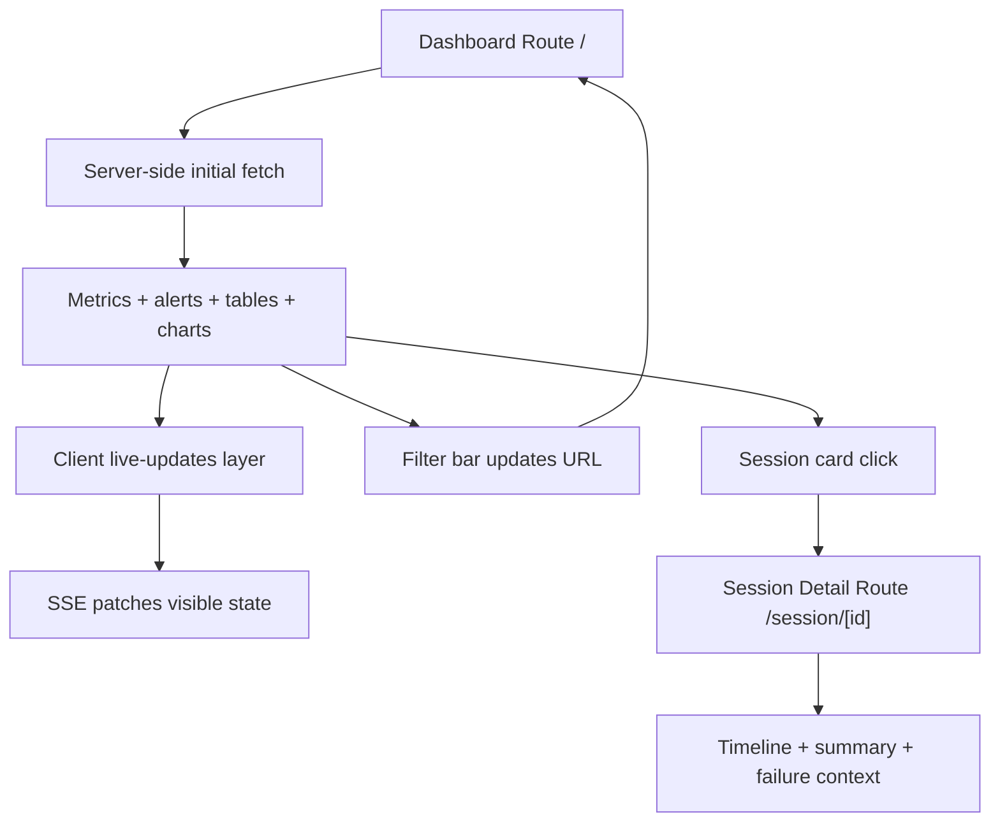
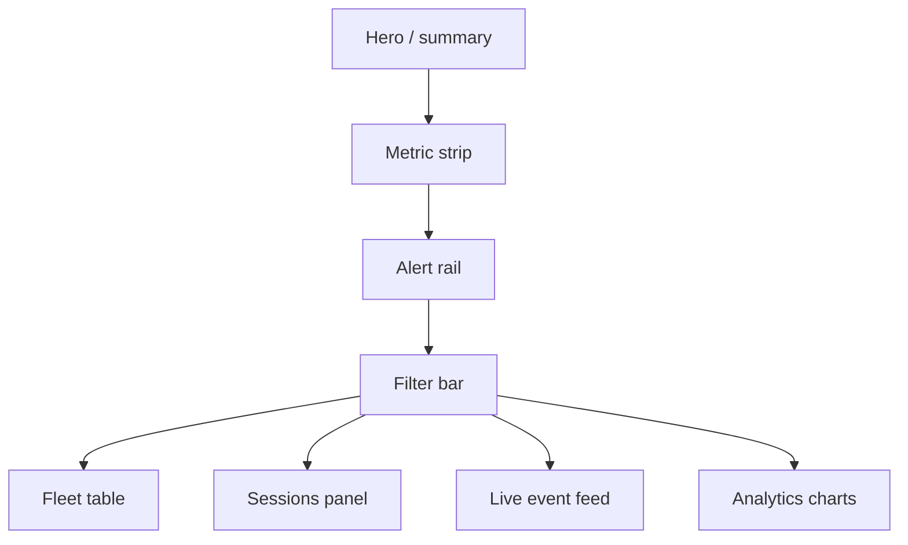
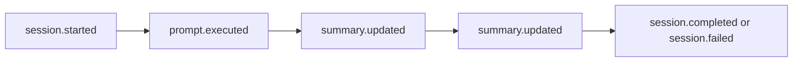
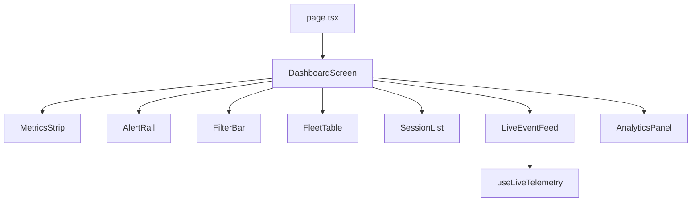
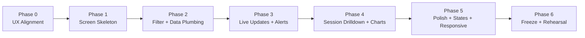

# Frontend Team Game Plan

## Mission

Turn the current Next.js dashboard into a presentation-quality mission-control console for distributed AI coding agents.

The frontend should make AgentHarbor feel:

- live
- legible
- operational
- impressive in under thirty seconds

The backend will provide telemetry, aggregates, and a live event stream.
The frontend's job is to turn that data into a story that the audience can understand immediately.

## What Already Exists

The current dashboard already has useful foundations:

- `apps/dashboard/src/app/page.tsx` renders a landing dashboard with stats, runners, sessions, and recent events.
- `apps/dashboard/src/app/session/[id]/page.tsx` renders a session detail page.
- `apps/dashboard/src/lib/control-node.ts` already fetches control-node APIs with server-side requests.
- `apps/dashboard/src/app/globals.css` already establishes a strong control-tower visual language.

Do not throw that away.
Extend it into a better operator experience.

## Demo Story To Support

By demo day, the frontend should support this exact experience:

1. Open the dashboard and immediately see a live fleet overview.
2. Notice active runners, active sessions, and recent failures.
3. Filter the dashboard down to one agent type or one runner label.
4. Watch new events appear without reloading the page.
5. Click into a failed session and see a clean timeline with enough detail to explain what happened.
6. Return to the main dashboard and show trend visuals responding to ongoing telemetry.

If the UI can do that smoothly, the audience will believe the platform is real.

## Recommended Team Split

A practical frontend split is two students:

| Student    | Primary Ownership                                     | Secondary Ownership         | Core Files                                                                                     |
| ---------- | ----------------------------------------------------- | --------------------------- | ---------------------------------------------------------------------------------------------- |
| Frontend A | Data plumbing, search params, live stream integration | Session detail interactions | `apps/dashboard/src/lib/control-node.ts`, new client components                                |
| Frontend B | Layout, visual system, charts, responsive behavior    | Empty/loading/error states  | `apps/dashboard/src/app/page.tsx`, `apps/dashboard/src/app/globals.css`, new shared components |

They should work against the same component plan from day one.

## Frontend Target



## Product Principles

The frontend team should use these principles as a guardrail:

### 1. Everything should answer an operator question

Examples:

- Which runners are online?
- Which sessions are active?
- Which session just failed?
- Which agent type is busiest?
- Why did this session fail?

### 2. The UI should reward attention

When new data arrives, the UI should react clearly:

- event feed updates
- counters tick up
- charts move
- alerts appear

### 3. Live is better than dense

Do not fill the screen with ten mediocre tables.
Show fewer surfaces, but make them visibly alive and easier to explain.

### 4. Preserve the current visual language

The current `globals.css` already gives you:

- dark control-room styling
- glassy panels
- strong accent color
- dashboard typography

Keep that direction and improve it.
Do not spend time on a total brand redesign.

## Recommended Information Architecture

Keep the route structure simple:

- `/` for the main mission-control dashboard
- `/session/[id]` for session drilldown

Do not add many new pages unless there is a clear demo payoff.

Instead, improve the density and clarity of the existing views.

## Main Dashboard Layout

Recommended sections for `/`:

1. Header and system summary
2. Global metric strip
3. Alert rail
4. Filter bar
5. Fleet table
6. Active and recent sessions panel
7. Live telemetry feed
8. Analytics charts

Suggested layout:



## Workstream 1: Filterable Dashboard

The current home page fetches fixed endpoints with fixed limits.
That should become filter-driven.

Recommended filters:

- status
- agent type
- label
- runner
- time window
- search text

Keep filters in the URL so the dashboard is shareable and refresh-safe.

Example page contract:

```ts
export default async function HomePage({
  searchParams,
}: {
  searchParams: Promise<Record<string, string | string[] | undefined>>;
}) {
  const query = await searchParams;
  const data = await getDashboardData(query);

  return <DashboardScreen initialData={data} initialQuery={query} />;
}
```

Example helper sketch:

```ts
function buildQueryString(params: Record<string, string | string[] | undefined>) {
  const search = new URLSearchParams();

  for (const [key, value] of Object.entries(params)) {
    if (!value) continue;
    if (Array.isArray(value)) {
      for (const item of value) search.append(key, item);
    } else {
      search.set(key, value);
    }
  }

  return search.toString();
}
```

Definition of done:

- Changing a filter updates the URL.
- Refreshing the page preserves the state.
- The backend receives real query parameters for all major surfaces.

## Workstream 2: Live Updates Layer

This is the frontend feature that turns the UI from static to impressive.

Consume the backend SSE stream in a client component.
Patch the live event feed immediately.
Then either patch metrics locally or trigger a light refresh for aggregate panels.

Recommended architecture:

- server components for initial page fetch
- one client wrapper for live updates
- small child components for feed, alerts, and session badges

Example SSE hook sketch:

```tsx
"use client";

import { useEffect, useState } from "react";

export function useLiveTelemetry() {
  const [events, setEvents] = useState<any[]>([]);
  const [connected, setConnected] = useState(false);

  useEffect(() => {
    const source = new EventSource("/api/stream/events");

    source.addEventListener("open", () => setConnected(true));
    source.addEventListener("error", () => setConnected(false));
    source.addEventListener("telemetry.created", (event) => {
      const payload = JSON.parse((event as MessageEvent).data);
      setEvents((current) => [payload, ...current].slice(0, 50));
    });

    return () => source.close();
  }, []);

  return { events, connected };
}
```

If you need a proxy route in Next.js to avoid mixed-origin issues, add one.
Do not let deployment friction block the live updates feature.

Definition of done:

- The event feed updates live while the presenter watches.
- The page visibly indicates whether it is connected to the stream.
- A reconnect does not require a manual refresh.

## Workstream 3: Alert Rail

Add a small high-signal alert section near the top of the page.
This should answer: what needs attention right now?

Suggested alert types:

- runner offline
- session failed
- failure burst in the last 10 minutes
- no active runners

Suggested component shape:

```tsx
interface AlertItem {
  id: string;
  severity: "info" | "warning" | "critical";
  title: string;
  detail: string;
  href?: string;
}
```

Suggested rendering rule:

- show at most 3 to 5 alerts
- critical first
- one-click path into the affected session or filter view

Definition of done:

- A failed session creates an alert surface the audience can see right away.
- An alert can take the presenter directly into the relevant session or filtered list.

## Workstream 4: Session Detail Timeline

The current session detail page is a good start.
The goal is to make it presentation-grade.

Add these sections:

- summary cards
- status and failure reason
- visual event timeline
- token usage and files touched metrics
- raw event feed for detail

Recommended timeline design:



Possible component breakdown:

- `SessionHero`
- `SessionSummaryCards`
- `SessionTimeline`
- `SessionMetricsChart`
- `SessionEventList`

Timeline item sketch:

```tsx
interface TimelineItemProps {
  eventType: string;
  summary?: string;
  createdAt: string;
  category?: string;
  status?: string;
}

export function TimelineItem(props: TimelineItemProps) {
  return (
    <div className="timeline-item">
      <div className={`timeline-dot timeline-${props.status ?? "neutral"}`} />
      <div>
        <strong>{props.eventType}</strong>
        <p>{props.summary ?? "No summary attached."}</p>
        <span>{new Date(props.createdAt).toLocaleString()}</span>
      </div>
    </div>
  );
}
```

Definition of done:

- The session page makes a success path and failure path both easy to narrate.
- The presenter can explain a failure without reading raw JSON.

## Workstream 5: Analytics Visuals

The frontend should make use of the backend aggregate endpoints.
You do not need a huge charting library unless it saves time.

Minimum recommended visuals:

- sessions by agent type
- event volume over time
- failure categories

You can build effective visuals with plain CSS and SVG if needed.

Example bar-chart pattern without a dependency:

```tsx
interface BarPoint {
  label: string;
  value: number;
}

export function SimpleBarChart({ points }: { points: BarPoint[] }) {
  const max = Math.max(...points.map((point) => point.value), 1);

  return (
    <div className="bar-chart">
      {points.map((point) => (
        <div className="bar-row" key={point.label}>
          <span>{point.label}</span>
          <div className="bar-track">
            <div className="bar-fill" style={{ width: `${(point.value / max) * 100}%` }} />
          </div>
          <strong>{point.value}</strong>
        </div>
      ))}
    </div>
  );
}
```

Definition of done:

- At least three charts are driven from real backend data.
- At least one chart changes while demo traffic is running.

## Workstream 6: Fleet Table And Session Cards

Improve the existing list views so they are easier to scan quickly.

Fleet table should clearly show:

- runner name
- machine metadata
- labels
- status
- active session count
- last seen

Session cards should clearly show:

- runner name
- agent type
- status
- summary
- event count
- duration
- files touched
- token usage if present

Add status-first styling so a failed session is visually loud.

Definition of done:

- A presenter can point at the screen for two seconds and the audience can distinguish healthy versus failed activity.

## Workstream 7: Loading, Error, And Empty States

This is not optional.
A live demo with weak state handling looks unfinished immediately.

Add:

- loading skeletons for metric cards and tables
- empty state when there are no sessions yet
- error banner when control-node fetch fails
- disconnected badge when SSE drops

The audience may never see all of these, but the presenter definitely will during rehearsal.

Definition of done:

- The UI never collapses into a blank screen when data is delayed.

## Workstream 8: Responsive Demo Readiness

The primary demo is likely on a laptop screen or projector, but the layout still needs to degrade cleanly.

Required responsive checkpoints:

- laptop width around 1440px
- smaller laptop width around 1280px
- tablet width around 768px

Specific rules:

- keep the main story visible without excessive scrolling
- avoid tables overflowing badly
- collapse less important panels below the fold on narrow screens

Definition of done:

- The dashboard still looks intentional when screen width changes.

## Suggested Component Architecture

Keep most components small and composable.



Recommended new components:

- `dashboard-screen.tsx`
- `filter-bar.tsx`
- `alert-rail.tsx`
- `live-event-feed.tsx`
- `analytics-panel.tsx`
- `simple-bar-chart.tsx`
- `session-hero.tsx`
- `session-timeline.tsx`

## Implementation Phases

This section translates the frontend plan into the order the team should actually execute it.

The goal is to keep the frontend moving even while the backend is still landing features.
Build the dashboard in layers so the screen is always getting closer to demo-ready instead of waiting for one big integration moment.



### Phase 0: Align On The Operator Story

Objective:

- make sure both frontend students are building one coherent operator experience

Steps:

1. Review the current `apps/dashboard/src/app/page.tsx`, `apps/dashboard/src/app/session/[id]/page.tsx`, and `apps/dashboard/src/app/globals.css` together.
2. Decide which dashboard sections are mandatory for demo day and which are stretch goals.
3. Confirm with the backend team which filters, metrics, chart endpoints, and stream events will exist.
4. Sketch the homepage and session detail page before making structural code changes.
5. Agree on a shared component map so both students can work without colliding.

Outputs:

- agreed information architecture
- agreed filter list
- agreed chart list
- agreed component ownership

Backend dependency:

- stable list of API fields, query params, and stream event names

### Phase 1: Build The Screen Skeleton With Mocked Data

Objective:

- get the structure of the dashboard visible early, even before all live integrations exist

Steps:

1. Refactor the homepage into clear sections such as metric strip, alert rail, filter bar, fleet table, session list, event feed, and analytics panel.
2. Break the session detail page into smaller components.
3. Create placeholder or mocked data structures so the layout can be tested before backend features are fully ready.
4. Preserve the current visual direction from `globals.css` while improving hierarchy and spacing.
5. Make sure the homepage already looks like the final product in broad strokes.

Recommended first components:

- `DashboardScreen`
- `MetricsStrip`
- `AlertRail`
- `FilterBar`
- `FleetTable`
- `SessionList`
- `LiveEventFeed`
- `AnalyticsPanel`
- `SessionTimeline`

Outputs:

- stable component skeleton
- first-pass homepage layout
- first-pass session detail layout

Definition of done:

- a presenter looking at mocked data could already understand what the product is

### Phase 2: Wire Filter State And Backend Data Fetching

Objective:

- move the UI from hardcoded panels to backend-driven surfaces

Steps:

1. Update `getDashboardData()` and related fetch helpers so they accept search params instead of fixed limits only.
2. Move filter state into the route URL using `searchParams`.
3. Make filter controls update the URL cleanly.
4. Connect fleet, sessions, and event panels to the real filterable backend routes.
5. Verify that refresh and deep linking preserve the same view state.
6. Add clear empty states for filtered views with no results.

Recommended verification examples:

- filter to failed sessions only
- filter to one agent type
- filter to one label
- search by session summary or session key

Outputs:

- URL-driven dashboard filters
- backend-connected list panels
- preserved state across refresh

Backend dependency:

- filterable runners, sessions, and events routes

### Phase 3: Integrate Live Updates And Build The Alert Rail

Objective:

- make the dashboard visibly alive

Steps:

1. Add a client component or hook that subscribes to the backend SSE endpoint.
2. Update the live event feed immediately when new events arrive.
3. Add a connection badge so the presenter can see whether the live stream is connected.
4. Build an alert rail that derives high-signal conditions from live data and aggregate data.
5. Decide which panels should patch locally and which should refresh from the server after a new event.
6. Verify reconnect behavior by intentionally restarting the control node during development.

Recommended alert order:

1. failed session
2. runner offline
3. failure burst
4. no active runners

Outputs:

- working live event feed
- visible stream connection state
- alert surfaces linked to real failures

Definition of done:

- the UI clearly reacts when demo traffic starts or when a failure occurs

### Phase 4: Build Session Drilldown And Analytics Visuals

Objective:

- turn raw backend data into an explainable operator narrative

Steps:

1. Finish the session hero and summary cards.
2. Build the visual timeline using the ordered event history from the backend.
3. Add metrics such as duration, token usage, files touched, and event count to the session detail page.
4. Connect analytics panels on the homepage to real aggregate endpoints.
5. Make sure one chart shows activity over time and another chart shows categorical distribution.
6. Tune wording and labels so the presenter can narrate the page without translating technical jargon in real time.

Recommended analytics order:

1. sessions by agent type
2. event volume over time
3. failures by category

Outputs:

- polished session detail page
- real analytics panels
- operator-friendly labels and summaries

Backend dependency:

- stable session detail shape
- analytics endpoints
- consistent failure categories

### Phase 5: Add Polish, States, And Responsive Behavior

Objective:

- remove the rough edges that make demos feel unfinished

Steps:

1. Add loading skeletons for all major panels.
2. Add error states for failed data fetches.
3. Add disconnected state for dropped SSE connections.
4. Refine typography, spacing, emphasis, and hover behavior.
5. Verify the layout on projector-sized laptop widths and narrower widths.
6. Reduce visual noise where the page feels too dense.

Recommended responsive checkpoints:

- 1440px
- 1280px
- 1024px
- 768px

Outputs:

- resilient states for loading and failure
- visually cleaner dashboard
- responsive layout that still tells the story

Definition of done:

- the UI still looks intentional even when data is delayed, missing, or reconnecting

### Phase 6: Freeze The Surface And Rehearse The Presenter Flow

Objective:

- make the presentation smooth and low-risk

Steps:

1. Freeze large layout changes once the full demo path works.
2. Rehearse the exact click path for the main presentation.
3. Tune list ordering, chart defaults, and alert thresholds so the most important information appears first.
4. Verify that failure scenarios are visible quickly and not buried below the fold.
5. Prepare one fallback dashboard state in case live traffic is slower than expected.
6. Walk the demo with the backend team so timing, filters, and session drilldown all line up.

Recommended presenter path:

1. open homepage
2. point out metric strip and live connection
3. show active sessions and event feed moving
4. point out failure alert
5. click failed session
6. explain timeline
7. return and apply filters

Definition of done:

- the frontend team can drive the entire story on demo day without hunting for UI elements

## Frontend Week-By-Week Plan

### Week 1: Structure And Contracts

Goals:

- finalize the dashboard layout
- lock filter names with the backend team
- build URL-driven filtering
- create component shells using mocked data

Exit criteria:

- the main page layout is stable
- every planned panel exists, even if some use mock data

### Week 2: Live Data Integration

Goals:

- connect list and analytics panels to real APIs
- integrate SSE live event updates
- build alert rail behavior
- improve runner and session surfaces

Exit criteria:

- the dashboard can stay open and react to incoming demo traffic

### Week 3: Session Detail And Visual Polish

Goals:

- finish the timeline view
- add charts and trend panels
- add loading and error states
- refine styling, spacing, and scanability

Exit criteria:

- the presenter can navigate the full demo without apologizing for unfinished UI

### Final 3-4 Days: Freeze And Rehearsal

Goals:

- stop introducing large structural changes
- tune spacing and typography
- verify projected readability
- rehearse timing with backend scenarios

Exit criteria:

- the team has one stable demo path and one fallback path

## Frontend Acceptance Checklist

- The home page feels live within five seconds of opening it.
- Filters drive the backend, not just the browser state.
- Failed sessions are obvious.
- Session detail explains the sequence of events clearly.
- Charts and counters reinforce the live system story.
- Loading and disconnect states are handled gracefully.

## Non-Goals

Do not spend the schedule on:

- a total visual rebrand
- dozens of extra routes
- custom animation systems
- generic admin dashboard sprawl
- features that do not help the presenter tell the story

## Frontend Definition Of Done

The frontend team is done when:

- the main dashboard looks polished
- live updates are visible
- filters are stable and useful
- alerts call attention to failures
- the session detail page tells a clean narrative
- the entire interface supports the demo without awkward dead ends

If the backend team makes the data real and the frontend team makes the story obvious, the final presentation will land.
